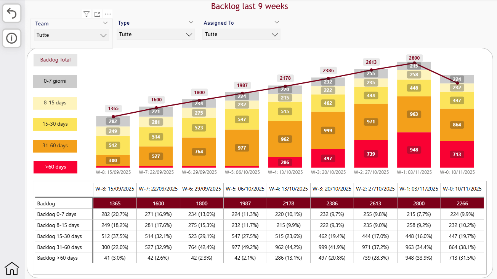
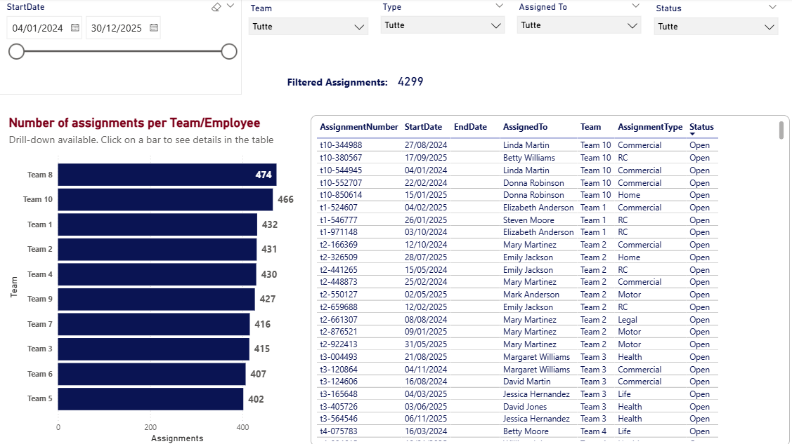
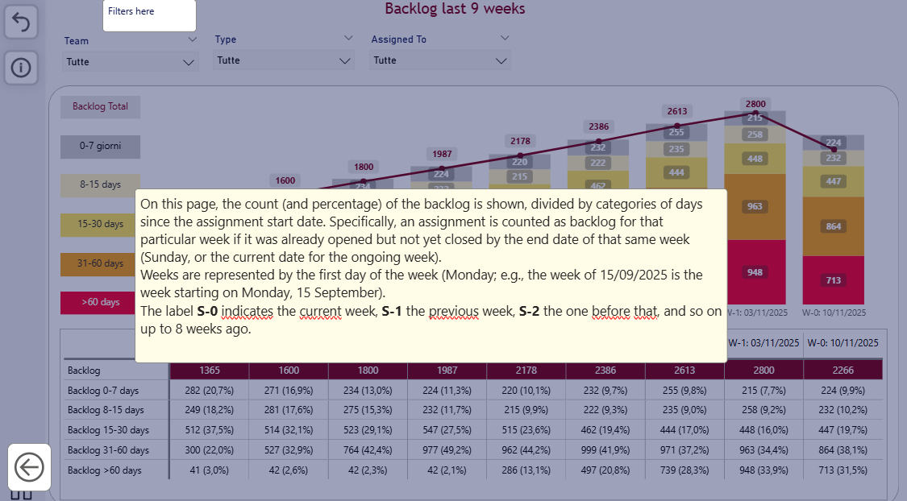

# 📊 Insurance Assignments Monitoring Dashboard

Business Intelligence dashboard designed to monitor insurance claim assignments, operational workload and backlog evolution across the claims management process.



---

## Business Context

Insurance companies continuously assign new claims to external adjusters for technical assessment.

Operations managers need a centralized view of assignment status, workload distribution and backlog evolution to ensure claims are processed efficiently and operational bottlenecks are identified early.

This dashboard provides an interactive overview of insurance assignments, helping operational teams monitor daily activities and support workload planning.

---

## Business Process

Each insurance assignment follows a simple operational workflow.

```text
Claim Assignment
        ↓
Technical Assessment
        ↓
Administrative Activities
        ↓
Claim Closure
```

Throughout this process, assignments can remain pending for different reasons, generating operational backlog that requires continuous monitoring.

---

## Business Questions

This dashboard helps answer questions such as:

- How many assignments are currently pending?
- Is backlog increasing or decreasing over time?
- Which teams are managing the highest workload?
- Which employees currently have the largest number of assignments?
- Which backlog aging categories require immediate attention?

---

## Dashboard Features

- Weekly backlog monitoring
- Assignment analysis by Team and Employee
- Aging distribution analysis
- Interactive filtering
- Custom navigation buttons
- Built-in information panel

---

## Backlog Monitoring

The dashboard tracks weekly backlog evolution, categorizing pending assignments by aging range to help managers identify operational pressure and prioritize activities.


---

## Team & Employee Analysis

Operational workload can be analyzed at both team and employee level through drill-down visualizations and interactive filters.



---

## Built-in Documentation

The report includes an integrated information panel explaining dashboard metrics, business logic and navigation, allowing users to quickly understand the report without additional documentation.



---

## Technical Highlights

### Data Model

- Star schema
- Power Query transformations
- Dynamic DAX measures
- Interactive filtering

### Technology Stack

- Power BI Desktop
- Power Query
- DAX
- Microsoft Excel

---

## Dataset

The dataset is entirely fictional and was created exclusively for portfolio purposes.

Although simulated, it reproduces a realistic insurance claims operational workflow, including assignment management, backlog evolution and workload distribution.

---

## Repository Contents

- `Insurance Assignments Monitoring Dashboard.pbix`
- `insurance_assignments_dataset.xlsx`
- `page1.png`
- `page2.png`
- `infopanel.png`
- `README.md`

---

## Disclaimer

This project was created exclusively for educational and portfolio purposes.

All companies, assignments, teams and operational data are entirely fictional.
