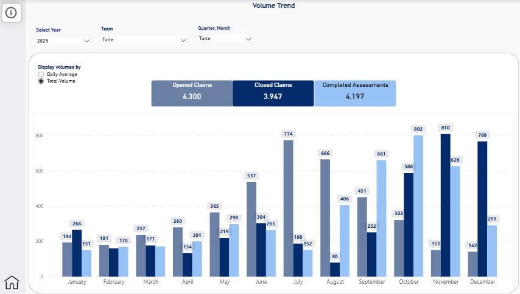
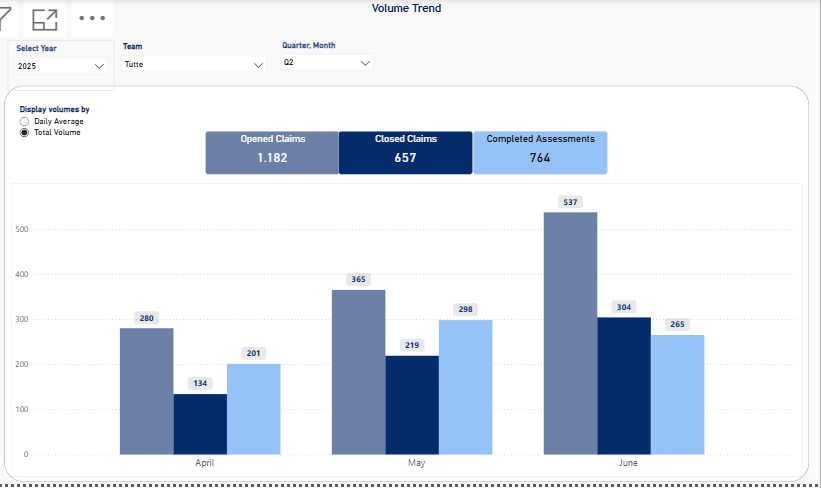
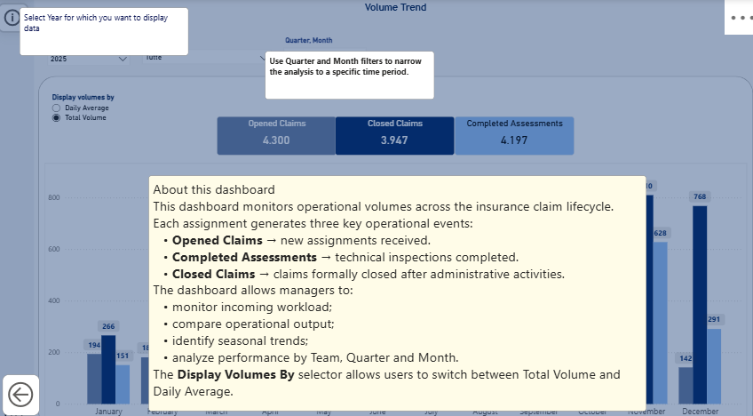

# 📊 Insurance Claims Volume Monitoring

Business Intelligence dashboard designed to monitor operational volumes across the insurance claims lifecycle.

---

## Business Context

Insurance companies receive claim assignments throughout the year.

Operational workload naturally fluctuates over time. During peak periods (typically summer months), incoming assignments increase significantly, making it difficult for operational teams to keep pace with assessments and claim closures. During quieter periods, teams progressively recover the accumulated backlog.

This dashboard was designed to monitor these operational dynamics and support workload planning.

---

## Business Process

Each assignment follows three operational milestones.

| Metric | Description |
|--------|-------------|
| **Opened Claims** | New claim assignments received from insurance companies. |
| **Completed Assessments** | Technical inspections completed by adjusters. |
| **Closed Claims** | Claims formally closed after administrative processing. |

---

## Key Features

- Dynamic Reporting Year parameter
- Team filtering
- Quarter and Month filtering
- Total Volume / Daily Average toggle
- Interactive information panel
- Monthly operational trend analysis

---

## Interactive Filtering

Quarter and Month filters allow users to focus on a specific reporting period, making seasonal trends easier to identify.

---

## Built-in Documentation

The dashboard includes an integrated information panel explaining the business process, KPI definitions and report usage, allowing new users to quickly understand the solution without additional documentation.

---

## Technical Highlights

**Data Model**

- Star schema
- Disconnected Calendar table
- Reporting Year parameter
- Dynamic DAX measures
- Power Query transformations

**Technology Stack**

- Power BI
- Power Query
- DAX
- Excel

---

## Dataset

The dataset is entirely fictional and was created exclusively for portfolio purposes.

Although simulated, it reproduces a realistic insurance claims operational workflow, including seasonal workload peaks, assessment delays and backlog recovery.

---

## Repository Contents

- Insurance Claims Volume Monitoring.pbix
- insurance_claims_volume_monitoring.xlsx
- README.md

---

## Disclaimer

This project was created exclusively for educational and portfolio purposes.

All companies, agencies, teams, assignments and operational data are entirely fictional and do not represent any real organization.
