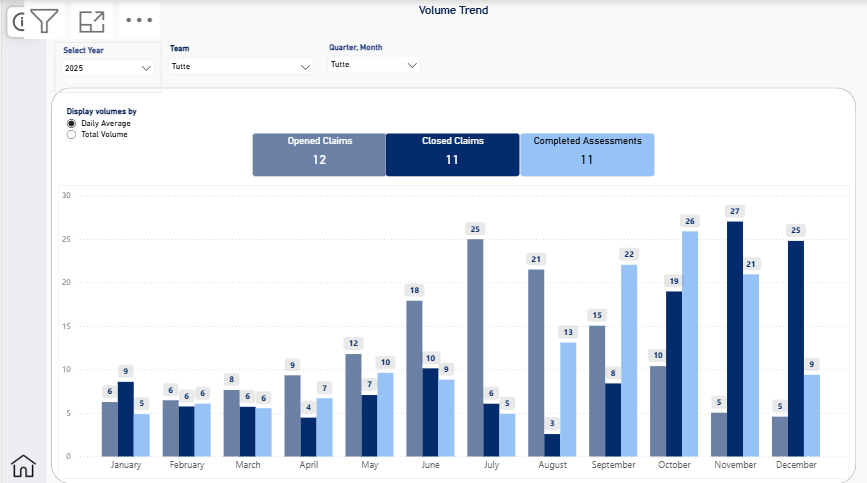

# 📊 Insurance Claims Volume Monitoring

Business Intelligence dashboard designed to monitor operational volumes across the insurance claims lifecycle.

---

## Business Context

Insurance companies assign new claims throughout the year.

Operational workload naturally fluctuates over time. During seasonal peaks, incoming assignments increase significantly, making it difficult for operational teams to keep pace with technical assessments and administrative closures. During quieter periods, accumulated backlog is progressively recovered.

This dashboard provides operational managers with a centralized view of workload trends, helping them monitor performance and support capacity planning.

---

## Business Process

Each assignment generates three key operational events.

| Metric | Description |
|--------|-------------|
| **Opened Claims** | New claim assignments received from insurance companies. |
| **Completed Assessments** | Technical inspections completed by adjusters. |
| **Closed Claims** | Claims formally closed after administrative processing. |

These three metrics represent different stages of the same operational workflow and provide a complete view of incoming demand and operational throughput.

---

## Business Questions

The dashboard helps answer questions such as:

- How many new claims entered the operational workflow?
- Are completed assessments keeping pace with incoming demand?
- How many claims are being formally closed?
- Which teams are handling the highest operational workload?
- How does workload evolve throughout the year?

---

## Dashboard Features

- Dynamic Reporting Year parameter
- Team filtering
- Quarter and Month filtering
- Total Volume / Daily Average toggle
- Monthly operational trend analysis
- Built-in dashboard documentation

---

## Daily Average View

Users can seamlessly switch between **Total Volume** and **Daily Average**, allowing operational performance to be analyzed from both absolute and normalized perspectives.

---

## Interactive Filtering

Quarter and Month filters allow users to focus on a specific reporting period, making seasonal workload patterns easier to identify.

---

## Built-in Documentation

The dashboard includes an integrated information panel describing business logic, KPI definitions and report usage, allowing users to quickly understand the solution without external documentation.

---

## Technical Highlights

### Data Model

- Star schema
- Disconnected Calendar table
- Dynamic Reporting Year parameter
- Dynamic DAX measures
- Power Query transformations

### Technology Stack

- Power BI Desktop
- Power Query
- DAX
- Microsoft Excel

---

## Dataset

The dataset is entirely fictional and was created exclusively for portfolio purposes.

Although simulated, it reproduces a realistic insurance claims operational workflow, including seasonal workload peaks, temporary assessment delays and backlog recovery.

---

## Repository Contents

- `Insurance Claims Volume Monitoring.pbix`
- `insurance_claims_volume_monitoring_dataset.xlsx`
- `overview.png`
- `daily-average.png`
- `quarter-filter.png`
- `info-panel.png`
- `README.md`

---

## Disclaimer

This project was created exclusively for educational and portfolio purposes.

All companies, agencies, teams, assignments and operational data are entirely fictional and do not represent any real organization.
